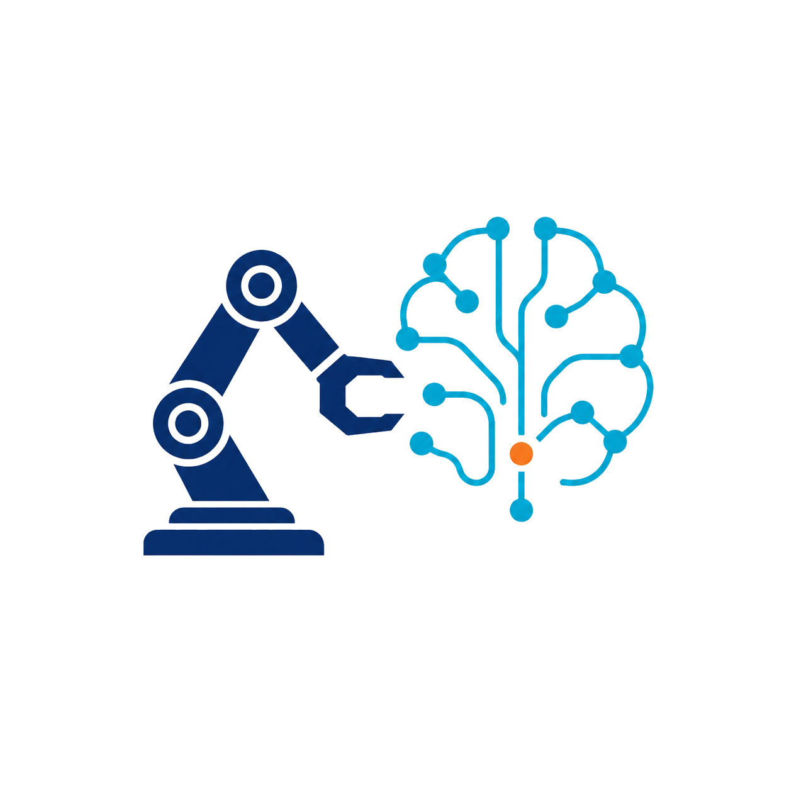

<h1 align="center">
  
  WorldAgen
</h1>
<p align="center"><b>Unified State-Action Prediction with Test-Time World Model Training</b></p>

<!-- Badges -->
<div align="center">

[](https://ojs.aaai.org/index.php/AAAI/article/view/38925)
[](https://worldagen.github.io/)
[](https://huggingface.co/MLL-Lab/worldagen)
[](./LICENSE)

</div>

<p align="center">
  Chi Wan<sup>1</sup>,
  Kangrui Wang<sup>1,*</sup>,
  Yuan Si<sup>1</sup>,
  Pingyue Zhang<sup>1</sup>,
  Manling Li<sup>1</sup>
</p>
<p align="center">
  <sup>1</sup>Northwestern University
</p>
<p align="center">
  <sup>*</sup>Project Lead
</p>

<p align="center">
  
</p>

---

## 📢 Updates

- **[2026-05-28]** WorldAgen is accepted to **AAAI 2026** 🚀. We release the codebase, [trained checkpoints](https://huggingface.co/MLL-Lab/worldagen), and the project [homepage](https://worldagen.github.io/).

## 🌟 Overview

How can vision-language-action (VLA) models adapt to new environments where world dynamics shift? Existing methods that combine world modeling with action prediction rely on pretraining over static datasets and lack mechanisms for active adaptation at deployment, so they struggle to generalize to unseen object configurations and dynamics.

**WorldAgen** is a unified framework that jointly learns world modeling and action prediction while enabling **Test-Time Training (TTT)** for adaptation to new environments. A shared Transformer backbone hosts two heads — a **world model head** that predicts future states from past state-action trajectories, and a **policy head** that predicts actions conditioned on task instructions — disentangled by a **Mixed Unidirectional Attention Mask**. At test time, WorldAgen samples exploratory actions, collects ground-truth state transitions, and performs lightweight TTT updates to refine its world model, yielding consistent gains on **CALVIN** and **LIBERO**.

For more details, see our [paper](https://ojs.aaai.org/index.php/AAAI/article/view/38925) and [project homepage](https://worldagen.github.io/).

## 🔥 Key Contributions

- **Unified World Model + Action Prediction Framework**
  WorldAgen introduces a Transformer-based architecture that jointly learns **state (world dynamics)** and **action policies**, enabling tighter coupling between environment understanding and decision-making.

- **Test-Time World Model Training**
  WorldAgen performs **lightweight online adaptation at inference time** by collecting state transitions and updating the world model, improving robustness to unseen environments.

- **Improved Generalization via Adaptive World Modeling**
  By refining its internal world model during deployment, the method significantly enhances performance on challenging benchmarks, surpassing strong baselines with only a small number of test-time updates.

## 📦 Repository Structure

```
WorldAgen/
├── models/                              # Shared backbone + heads (Qwen3, GPT-2, ViT-MAE, Perceiver Resampler)
├── test_time_training/                  # Two-stage Test-Time Training (ttt.py, lora.py)
├── train_calvin.py / train_libero.py    # Training entry points
├── eval_calvin.py  / eval_libero.py     # Evaluation entry points
├── scripts/                             # Train / eval (with & without TTT) for CALVIN & LIBERO
├── utils/                               # Data processing & evaluation utilities
├── data_info/                           # Episode indices & LIBERO conversion metadata
├── docs/                                # CALVIN.md & LIBERO.md setup guides
└── requirements.txt
```

## 🚀 Getting Started <a name="start"></a>

**(1) Clone and create the environment**

```bash
git clone https://github.com/mll-lab-nu/WorldAgen.git
cd WorldAgen

conda create -n worldagen python=3.10 -y
conda activate worldagen
pip install -r requirements.txt
```

**(2) Set up a benchmark and download its data**

We provide step-by-step guides for two popular simulation benchmarks:

- **[CALVIN](docs/CALVIN.md)** — environment setup, dataset download, training, and evaluation.
- **[LIBERO](docs/LIBERO.md)** — environment setup, dataset download, training, and evaluation.

**(3) (Optional) Download pretrained checkpoints**

```bash
bash scripts/download_checkpoints.sh
```

**(4) Train and evaluate**

```bash
# CALVIN
bash scripts/calvin/train.sh          # train the base model
bash scripts/calvin/eval_wo_ttt.sh    # evaluate without TTT
bash scripts/calvin/eval_ttt.sh       # evaluate with Test-Time Training

# LIBERO
bash scripts/libero/train.sh
bash scripts/libero/eval_wo_ttt.sh
bash scripts/libero/eval_ttt.sh
```

## 📊 Experimental Results

### 🔹 CALVIN

| Method             | Task 1 | Task 2 | Task 3 | Task 4 | Task 5 | Mean Successful Rate (%) |
|--------------------|--------|--------|--------|--------|--------|----------|
| **WorldAgen**      | 96.3   | 87.7   | 76.8   | 67.3   | 59.1   | 77.4     |
| **WorldAgen-TTT**  | **96.6** | **88.5** | **78.5** | **68.7** | **60.5** | **78.6** |

### 🔹 LIBERO-10

| Method             | Mean Success Rate (%) |
|--------------------|-----------------|
| **WorldAgen**      | 75.5            |
| **WorldAgen-TTT**  | **79.0**        |

**WorldAgen-TTT** consistently improves performance across tasks, demonstrating the effectiveness of test-time world model adaptation.

## 🎬 Visualization

Below is a qualitative comparison of **WorldAgen** before and after applying Test-Time Training (TTT) on CALVIN. After adapting the world model, the agent performs more precise grasping and exhibits persistent retry behavior when facing failures.

<table>
  <tr>
    <td align="center">
      <br>
      <b>Before TTT</b>
    </td>
    <td align="center">
      <br>
      <b>After TTT</b>
    </td>
  </tr>
</table>

## 📚 Citation

If you find **WorldAgen** useful in your research, please cite our work:

```bibtex
@inproceedings{wan2026worldagen,
  title={WorldAgen: Unified State-Action Prediction with Test-Time World Model Training},
  author={Wan, Chi and Wang, Kangrui and Si, Yuan and Zhang, Pingyue and Li, Manling},
  booktitle={Proceedings of the AAAI Conference on Artificial Intelligence},
  volume={40},
  number={22},
  pages={18584--18592},
  year={2026}
}
```

## 🙏 Acknowledgment <a name="acknowledgment"></a>

This project builds upon [Seer](https://github.com/InternRobotics/Seer/tree/main). We thank the authors for their open-source contributions.

## 📄 License <a name="license"></a>

All assets and code are released under the [Apache 2.0 license](./LICENSE) unless specified otherwise.
